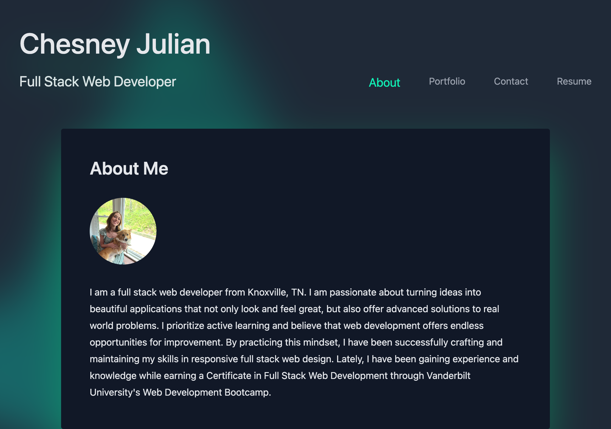

# React-Portfolio

## Description
This portfolio project is a single page, responsive web application using React, Vite, Netlify, and Tailwind CSS. This portfolio utilizes React state management to display different page sections displaying information regarding my background, my portfolio, a contact form, and my resume. The site also includes a downloadable Resume link. Futhermore, a footer can be found on all pages containing links to my GitHub and LinkedIn accounts. 
## Deployed Application
### URL
[https://chesney-julian-portfolio.netlify.app/](https://chesney-julian-portfolio.netlify.app/)
### Screenshot

## Usage
- Follow the link to the website.
- Click the items in the Navigatio bar to view the corresponding content
- Hover the mouse over each project image in the "Portfolio" section to see links to each project's deployed application as well as its GitHub Repository
- Fill out the form in the "Contact" section to send me an email.
- Click the "Download Resume" button in the "Resume" section to download a pdf version of my resume.
## Resources
- [Netlify](https://www.netlify.com/)
- [ReactJS](https://react.dev/)
- [ViteJS](https://vitejs.dev/)
- [Tailwind CSS](https://tailwindcss.com/)